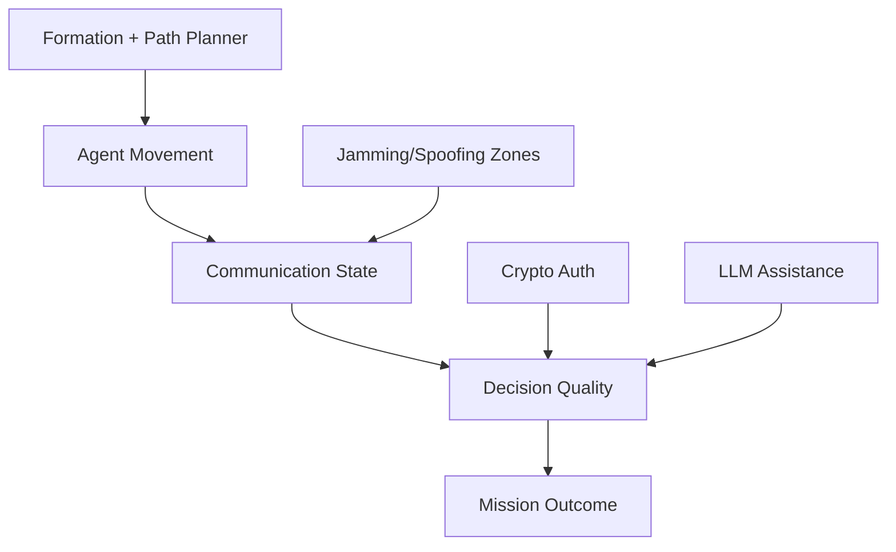

# Algorithms and Threat Model

This document explains what algorithm families Swarm Squad Ep1 exposes and how
attacks/countermeasures interact during a mission.

## Formation algorithms

Available formation modes:

- `communication_aware` (default)
- `v_formation`
- `line`
- `circle`
- `wedge`
- `column`
- `diamond`

`communication_aware` emphasizes maintaining swarm coherence under varying
communication quality, especially under jamming.

## Path planning algorithms

Available path algorithms:

- `direct`
- `astar`
- `theta_star`
- `dijkstra`
- `bfs`
- `greedy`
- `bi_astar`
- `msp`

High-level guidance:

- `direct`: fastest to run, least structured route planning.
- `astar`/`theta_star`: strong default choices for balanced performance.
- `dijkstra`/`bfs`: useful baselines for comparisons.
- `bi_astar`: can reduce search effort for larger maps.
- `msp`: experimental option for comparative studies.

## Communication model options

Swarm Squad supports two communication model modes in experiments:

- `v2v`: enhanced channel model
- `legacy`: baseline communication model

The GUI and simulation metrics let you compare mission behavior across models,
especially under jamming and spoofing pressure.

For deeper modeling notes, see `docs/communication_model_research.md`.

## Threat types

### Jamming and physical obstacle zones

Obstacle/jamming types:

- `physical`: hard obstacle
- `low_jam`: mild communication degradation
- `high_jam`: severe communication degradation

Jamming/obstacle response logic computes proactive avoidance and fallback behavior.

### Spoofing zones

Supported spoofing attacks:

- `phantom`: injects fake agents/messages
- `position_falsification`: corrupts positions with random offsets
- `coordinate`: systematic shift vector attack

These attacks target perceived state and route/formation decisions.

## Countermeasures

### Cryptographic authentication

Crypto algorithms:

- `hmac_sha256`
- `chacha20_poly1305`
- `aes_256_ctr`

When enabled, spoofed/tampered messages are rejected based on signature checks.

### LLM assistance

When enabled, LLM guidance helps recover or reroute agents when communication
quality drops below threshold, improving survivability in hostile zones.

Important:

- LLM and crypto mitigate different parts of the threat space.
- Crypto does not remove RF jamming effects.
- LLM guidance does not replace communication integrity checks.

## Practical interaction model

## Metrics you should monitor

In GUI panels and result outputs, track:

- destination reached / mission success
- steps to destination and runtime duration
- communication quality trends (`Jn`, averages)
- protocol stats (`sent`, `received`, `dropped`, `spoofed`, `rejected`)
- crypto detection metrics (`tp`, `fp`, `fn`, `tn`, precision, recall, FPR)

## Suggested classroom progression

1. Baseline (`communication_aware` + `astar`, no attacks).
2. Add one `low_jam` zone.
3. Add one spoofing zone (`phantom`), compare with crypto off/on.
4. Add combined high-jam + spoofing, compare with LLM off/on.
5. Repeat with different path algorithms and discuss trade-offs.
