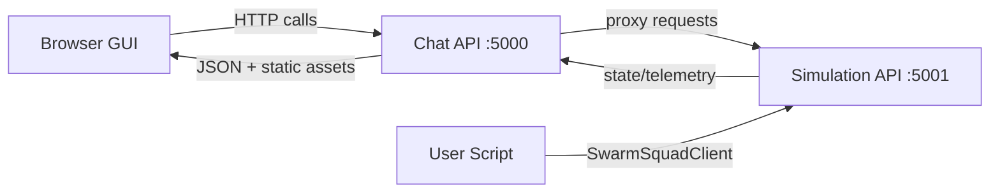

# System Overview

Swarm Squad Ep1 is an educational UAV swarm simulation platform with real-time
visualization, programmable control, and reproducible research experiments.

## Major subsystems

- `swarm_squad_ep1.simulation.api`
  - owns simulation state and update loop,
  - exposes attack/defense, algorithm, and telemetry endpoints.
- `swarm_squad_ep1.chat.app`
  - serves the web GUI assets,
  - proxies simulation endpoints used by the frontend,
  - hosts chat/tool interactions for guided control.
- `swarm_squad_ep1.client.SwarmSquadClient`
  - Python facade for direct script-based simulation control.
- `swarm_squad_ep1.research`
  - scenario generators and experiment runners for E1-E6.

## Runtime topology

- Chat/GUI service: `http://localhost:5000`
- Simulation service: `http://localhost:5001`

Default command:

```bash
uv run swarm-squad-ep1
```

This starts both services and keeps them monitored in one terminal session.

## Data and control flow



## Request patterns

GUI path:

1. Browser loads HTML/JS from chat service.
2. Frontend polls chat endpoints (`/health`, `/status`, `/visualization`, etc.).
3. Chat service forwards to simulation API when needed.
4. Frontend updates scene, panels, and metrics.

Script path:

1. Python script constructs `SwarmSquadClient`.
2. Script sends direct calls to simulation API (`/simulation/start`, zone endpoints, toggles).
3. GUI reflects the updated shared state immediately.

Research path:

1. `swarm-squad-ep1 research ...` builds scenario matrices.
2. Runs headless simulation loops.
3. Writes CSV/summary outputs and optional plots.

## Key capability areas

- Multi-agent formation and path planning.
- Jamming and spoofing attack simulation.
- Cryptographic authentication and comm integrity checks.
- Optional LLM assistance for degraded communication scenarios.
- Experiment automation for comparative evaluation.

## Package layout

Primary package namespace:

- `src/swarm_squad_ep1/algo/`
- `src/swarm_squad_ep1/simulation/`
- `src/swarm_squad_ep1/chat/`
- `src/swarm_squad_ep1/gui/static/`
- `src/swarm_squad_ep1/research/`
- `src/swarm_squad_ep1/client.py`
- `src/swarm_squad_ep1/cli.py`
- `src/swarm_squad_ep1/runtime.py`

## Operational dependencies

- Python runtime + dependencies from `pyproject.toml`
- Qdrant via Docker Compose
- Ollama for chat and LLM-guided behavior

See `docs/getting-started.md` for setup and `docs/troubleshooting.md` for recovery workflows.
